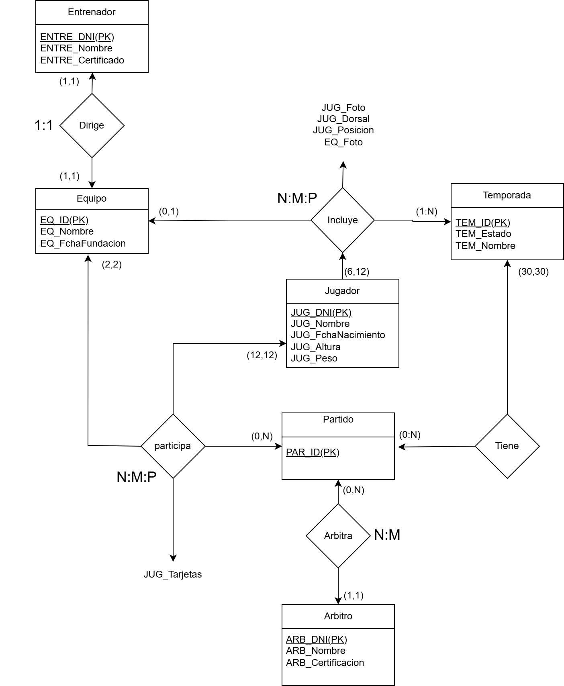
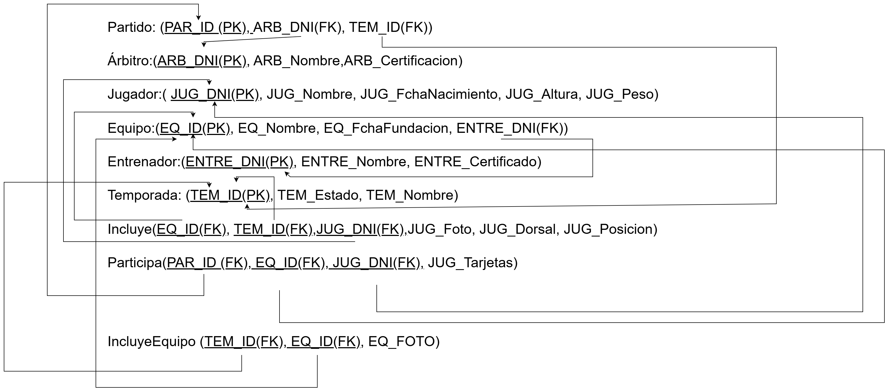
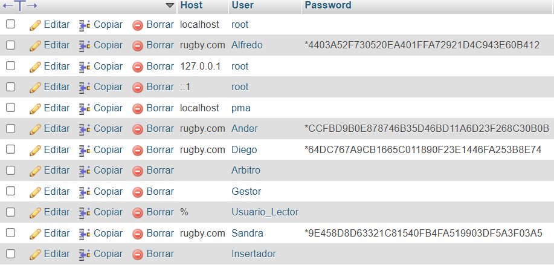
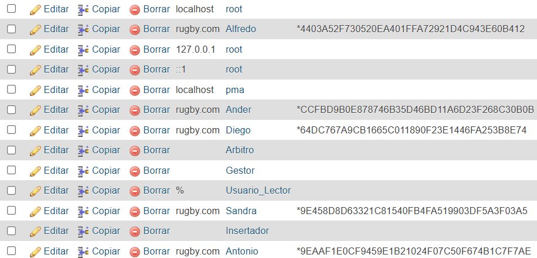

# DOCUMENTACION BASES DE DATOS G5

**Archivo SQL de la base de datos :**
[db.sql](federacion_rugby_v5.sql)

## Índice
1. [Diagrama ER](#diagrama-entidad-relacion)
2. [Modelo Relacional](#diagrama-modelo-relacional)
3. [Gestión de Usuarios](#gestion-de-usuarios)
4. [Procedimientos](#procedimientos)
5. [Funciones](#funciones)
6. [Vistas](#vistas)

## Diagrama Entidad relacion



## Diagrama Modelo Relacional




## Gestion De Usuarios

### Creación De Usuarios

Gestor no puede iniciar temporadas
Árbitro solo puede modificar los resultados de los partidos
Usuario normal solo puede ver la temporada iniciada

```sql
CREATE USER 'Alfredo'@'rugby.com' IDENTIFIED BY 'alfredo1'; -- (Árbitro)

CREATE USER 'Ander'@'rugby.com' IDENTIFIED BY 'Ander1'; -- (Gestor)

CREATE USER 'Diego'@'rugby.com' IDENTIFIED BY 'Diego1'; --  (Usuario lector)

CREATE USER 'Sandra'@'rugby.com' IDENTIFIED BY 'Ander1'; -- (Insertador)
```


Vamos a crear un usuario llamado Antonio y lo vamos a eliminar seguido.

```sql 
CREATE USER 'Antonio'@'rugby.com' IDENTIFIED BY 'Antonio123'; 
```


```sql
DROP USER 'Antonio'@'rugby.com';
```


Vamos a restablecer la contraseña al usuario “Gestor”.
```sql
SET PASSWORD FOR 'Ander'@'rugby.com' = PASSWORD('Ander12');
```

### Creación de Roles y Asignación de Privilegios:

```sql
CREATE ROLE 'Arbitro';

GRANT 'Arbitro' TO 'Alfredo'@'rugby.com';

CREATE ROLE 'Gestor';

GRANT 'Gestor' TO 'Ander'@'rugby.com';

CREATE ROLE 'Usuario_Lector';

GRANT 'Usuario_Lector' TO 'Diego'@'rugby.com';

CREATE ROLE 'Insertador';

GRANT 'Insertador' TO 'Sandra'@'rugby.com';
```
Le damos permisos al árbitro para que pueda modificar los goles del equipo local y del visitante.

```sql
GRANT UPDATE (Goles_Local, Goles_Visitante) ON partido TO 'Arbitro';
```

Le damos permisos al gestor para que solo pueda entrar en la tabla de temporadas para iniciarla o finalizarla.

```sql
GRANT UPDATE federacion_rugby.* TO 'Insertador';
```

Le damos permisos al Insertador para que pueda insertar datos en todas las tablas de la base de datos.

```sql
GRANT INSERT ON (Estado) ON temporada TO 'Gestor';
```

Creamos unas VISTAS para limitar el acceso a Usuario_Lector a la temporada iniciada:

Esta vista permitirá ver los Equipos de la Temporada Iniciada→


```sql
-- Tini = Temporada Iniciada
CREATE VIEW equipos_Tini AS

SELECT *

FROM equipos e

JOIN temporadas t ON t.id = e.temporada_id

WHERE t.estado = 'En Curso';
```


Una vez creada esa vista, le asignaremos los permisos.

```sql
GRANT SELECT ON equipos_Tini TO 'Usuario_Lector';
```

Con este comando: SHOW GRANTS FOR ‘Usuario_Lector’ podemos ver los permisos que tienen los usuarios, por ejemplo vamos a mostrar los permisos que tiene el Usuario Lector. Debería de tener acceso a la vista creada y a las tablas Equipo, Partido y Jugador.


Ahora, vamos a retirarle el permiso de inserción de datos en tablas a Usuario_Lector.

```sql
REVOKE INSERT ON *.* FROM 'Usuario_Lector';
```

## Procedimientos
[Procedures](procedures.md)

## Funciones

1. Conseguir nombre de entrenador en base a su DNI
```sql
    DELIMITER //

    CREATE FUNCTION NombreEntre(dni INT)
    RETURNS VARCHAR(255) -- devuelve un string 
    DETERMINISTIC
    BEGIN
        DECLARE nombre VARCHAR(255);
        DECLARE CONTINUE HANDLER FOR NOT FOUND -- por si no encuentra nada
            RETURN 'Entrenador no encontrado';
        SELECT ENT_Nombre INTO nombre
        FROM entrenador
        WHERE ENT_DNI = dni; -- filtrar en base a dni recivido

        RETURN nombre;
    END //

    DELIMITER ;
```
---

2. Devuelve el peso promedio de todos los jugadores

```sql
    DELIMITER //

    CREATE FUNCTION PesoMedioJug()
    RETURNS DECIMAL(5,2)
    DETERMINISTIC
    BEGIN
        DECLARE promedio DECIMAL(5,2);
        DECLARE CONTINUE HANDLER FOR NOT FOUND
            RETURN 0.00; -- devuelve 0 si no hay nada encontrado

        SELECT AVG(JUG_Peso) INTO promedio FROM jugador;

        IF promedio IS NULL THEN
            RETURN 0.00; -- si el select falla tambien devuelve 0
        END IF;

        RETURN promedio;
    END //

    DELIMITER ;
```
---

3. Devuelve el numero de jugadores en una temporada

```sql
    DELIMITER //

    CREATE FUNCTION JugadoresEnTemporada(tempor INT)
    RETURNS INT
    DETERMINISTIC
    BEGIN
        DECLARE done INT DEFAULT 0;
        DECLARE equipoID INT;
        DECLARE totalJugadores INT DEFAULT 0;

        DECLARE c CURSOR FOR 
            SELECT EQU_ID FROM incluyeEquipo WHERE TEM_ID = tempor;

        DECLARE CONTINUE HANDLER FOR NOT FOUND SET done = 1;

    
        OPEN c;  -- Abre cursor

        read_loop: LOOP
            FETCH c INTO equipoID;
            IF done THEN 
                LEAVE read_loop;
            END IF;

        
            SET totalJugadores = totalJugadores + (
                SELECT COUNT(*) FROM incluyeJugador WHERE EQU_TEM_ID = equipoID  -- Sumar jugadores por equipo en la temporada
            );
        END LOOP;

        CLOSE c;

        RETURN totalJugadores;
    END //

    DELIMITER ;
```

## Vistas 

1. Muestra todos los partidos de todas las temporadas con un formato facil de leer

```sql
CREATE OR REPLACE VIEW Partidos AS
SELECT 
    p.EQU_Gol_Loc AS "G0LES",
    el.EQU_Nombre AS "Local",
    "VS" AS "VS",
    ev.EQU_Nombre AS "Visitante",
    p.EQU_Gol_Vis AS "GOLES",
    t.TEM_Nombre AS "Temporada"
FROM partido p
JOIN equipo el ON p.EQU_ID_Loc = el.EQU_ID
JOIN equipo ev ON p.EQU_ID_Vis = ev.EQU_ID
JOIN temporada t ON p.TEM_ID = t.TEM_ID;
```

---

2. Muestra los entrenadores en la temporada actual

```sql
CREATE VIEW Entrenadores_TemporadaActual AS
SELECT 
  e.ENT_DNI AS "DNI",
  e.ENT_Nombre AS "Nombre",
  e.ENT_Certificacion AS "Certificacion",
  eq.EQU_Nombre AS "Equipo"
FROM entrenador e
JOIN equipo eq ON e.ENT_DNI = eq.ENT_DNI
JOIN incluyeEquipo ie ON eq.EQU_ID = ie.EQU_ID
JOIN temporada t ON ie.TEM_ID = t.TEM_ID
WHERE t.TEM_Estado = 'enCurso';
```